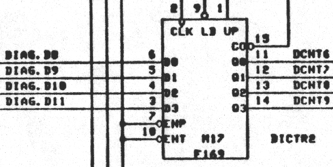
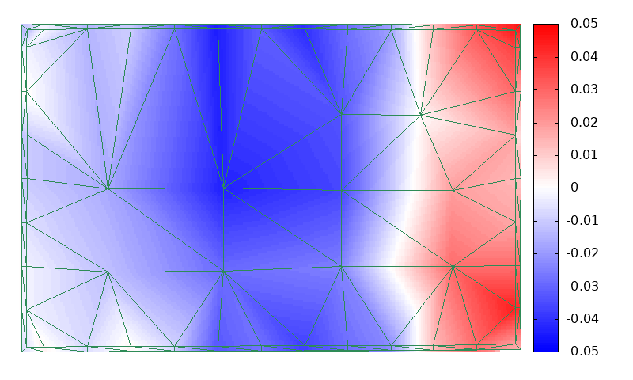
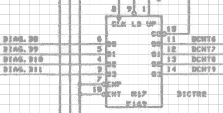
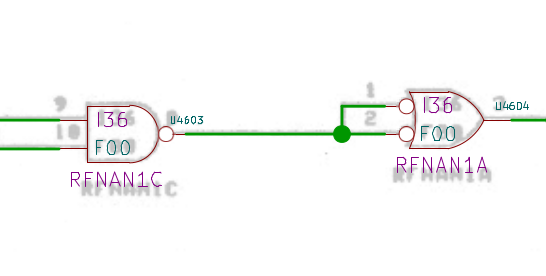

Rational R1000/400 Machine Readable Hardware documentation
==========================================================

This repository contains the process and the result for
Datamuseum.dk's production of machine readable hardware
documentation for the Rational R1000/400 computer.

The desired output of this project was a machine readable net-list
based on the paper schematics, but because we think the process we
followed to get there may be of general interest, in the context
of computer hardware preservation, this repository captures
the process from A to Z.

But first a bit of…

HOWTO information
-----------------

To refresh/create KiCad symbol files:

	make RebuildSymbols

To add background images to schematics before editing (optional):

	make AddImages

To remove background images *AND* prepare .kicad_sch files for
commit after editing:

	make RemoveImages

If you want to play with the Image-processing:

	make ImageProc

Please note that a lot of disk-space is required for that, and
you may want to put that elsewhere with two symlinks:

	ln -s /tank/downloaded_stuff CacheDir
	ln -s /tank/working_directory WorkDir

Ok, and now to the explanation:

Why ?!
------

In Datamuseum.dk we have a
[running Rational R1000 Computer(https://datamuseum.dk/wiki/Rational/R1000s400)
and since that is in all likelyhood the only one in the world which
will ever run again, we want to implement a software emulation
to preserve this unique machine for posterity.

Normally one would simulate the instruction set of the computer, but
the R1000 has no instruction set, in the sense that the 16 bit codes
the Ada compiler's code generator produces is a private contract with
the Microcode which interprets them.

We have figured out quite a lot about these codes, for instance that
0x008c means:

	Action Heap_Access,Diana_Put_Node_On_Seq_Type 

So, yeah, that's not feasible to emulate.

Instead we aim to emulate at the microcode level, we have almost
complete hardware and some amount of microcode documentation, but
since even the microcode has subroutine calls, that is also a
tall order.

So our first stage is simulating the computer at the circuit
level, all the chips and all the connections between them, and
for that we need the schematics in a form which can be used
to build that simulation, a so-called "net-list".

This project is about producing that from bad-ish photocopies
of the original schematics.

The raw material
----------------

The raw material is 407 schematics on US-letter-sized photo-copies
in a 3-hole binder which we received with the computer, probably
copies of copies of copies of the original 23x14" VersaTec plots.

Here is a random snapshot from the TYPE board:

The linework is generally OK, but the glyphs have suffered greatly
through the copying, and there are a number of sets which as a rule
cannot be told apart graphically:  B+D, 0+8, E+F, H+M+N etc.

We have scanned the paper in 600DPI 8-bit gray and stored the
resulting images in loss-less PDFs in our
[BitStore](https://datamuseum.dk/wiki/Bits:Keyword/RATIONAL_1000/DOCS)
along with the rest of the documentation for the machine.

Machine reading schematics
--------------------------

The base plan was always to redraw the schematics by hand in KiCad,
but in the absense of prior art about machine reading schematics,
we decided to make an attempt at it, since even moderate succeess
looked like it could translate to substantial savings in time.

We got much better results than we even thought possible, where
more than 90% of all symbols on the schematic could be correctly
identified and placed.

This result comes from a universe of one, and undoubtedly overoptimized
to the these specific schematics, and deriving a lot of benefit from
the restrictions of the machine tools ("Daisy") used in their preparation.

In the end, we did not use the component-list output of the image
processing, we only used geometrically corrected projected images
as background images, since adding components and lines were as fast
of not faster as scrutinizing the machine-placed ones, and dwarfted
by the effort to enter all the textual information, where we never
managed to get a usable read-rate.

However, the code for component identification is included in this
repository, both for future reference, and because the rectangular
chips located add control-points to the geometric correction.

Geometric correction
--------------------

Being able to use the scanned schematics as background images in
KiCad is only realistic, if the skew and other distortions can
be reduced to a neglible level.

The drawing border very conveniently contains arrows for each
inch on the original plot size btween two rectangular frames.

These features, and others, can be machine recognized and used
to build four delaunay-triangulations:

	 from pixel(x, y) to inch(x)
	 from pixel(x, y) to inch(y)
	 from inch(x,y) to pixel(x)
	 from inch(x,y) to pixel(y)

Compared to traditional unskewing by rotation and similar
methods, a delaunay-triangulation permits adding as many
control-points as desired, making it possible to correct
not only skew, but also the uneven feed rates of the copying
machines used along the way:

This is a very typical pattern, for machines with two feed rollers,
one before and one after the imaging zone.  In this case the total
aberation is 0.1" which is a full grid point on the raw material.

The delaunay projections can be built in both  be built in both directions

Using the inch->pixel delaunay-projections to create a corrected
image is a very slow process, but gives very good results:

Schematic capture
-----------------

As mentioned above, we ended up doing the schematic capture by hand
using the scanned schematics as background:

With a symbol library which as closely as possible matches
the original symbols, this is a really fast way to recapture
old schematics.

The most tedious part of the schematic capture was entering all
the text, because it took time to disambiguate 'B' and 'D' end so
on.

In order to catch as many mistakes as possible, we also typed
in the names and types of the chips found on the actual printed
circuit boards, and write scripts to cross-reference information
in the produced netlist with "ground truth".

Symbol library
--------------

Because the original schematics were prepared on Daisy and therefore
restricted to a 0.1" raster, probably in order to drive a VersaTec
electrostatic matrix plotter through a character generator, we were
able to create the KiCad symbols from "ascii-art" like this:

	   +-------+
	   |       |
	 11|       |
	-->+I0     |
	 12|       |
	-->+I1     |
	 13|       |
	-->+I2     |
	 14|       |
	-->+I3     |
	 15|       |10
	-->+I4  PEV+-->
	  1|       |
	-->+I5     |
	  2|       |9
	-->+I6  POD+-->
	  3|       |
	-->+I7     |
	  4|       |
	-->+I8     |
	  5|       |
	-->+I9     |
	  6|       |
	-->+I10    |
	  7|   xnn |
	-->+I11    |
	   |       |
	   | _     |
	   +-------+

These same ascii-arts is what enabled a very high recognition rate of
chips in the machine-reading experiment:  The pins on the four sides
of the chip, can be used to generate a "signature" of the pin locations
which can also be derived from the machine reading process:

	LI_I_I_I_I_I_I_I_I_I_I_IR________I___I__________TB

The non-rectangular components were entered by hand in KiCads component
editor, including the "deMorgan" variations many of them had:

Because the goal is to get a functional netlist for emulation
purposes, we did not bother with multiple units per symbol,
for instance the four NAND gates in a 74F00, we just have
a symbol called "F00" with a single NAND gate.
